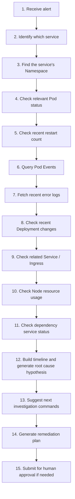

# AI Agent Takes Over Kubernetes Troubleshooting? — The Next-Gen Ops Through the Lens of EKS Knowledge Graphs

> **Source:** WeChat Official Account  
> **Original Title:** AI Agent 接管 Kubernetes 排障？从 EKS 知识图谱看下一代运维  
> **Archive Date:** 2026-05-29

---

AI + DevOps. For most people, this still sits firmly at one level:

- AI writes Shell scripts for you.
- AI writes Dockerfiles for you.
- AI generates Kubernetes YAML for you.
- AI explains error logs for you.

All of this is useful, but let's be honest — it doesn't really change the operations game.

What I find genuinely interesting is this: **AI is evolving from a "question-answering assistant" into an "Agent that participates in the troubleshooting process."** It no longer just tells you what command to run — it enters this kind of workflow:

```
Alert triggered
↓
Identify blast radius
↓
Collect logs, metrics, events, change records
↓
Understand service dependencies
↓
Infer probable root cause
↓
Provide remediation suggestions
↓
Even execute certain actions
```

This is where AI actually starts to impact DevOps in a meaningful way.

Recently AWS published a post about **AWS DevOps Agent + Amazon EKS Knowledge Graph**, showcasing a very telling direction: from alert generation, to identifying affected EKS clusters, to building a knowledge graph, and finally assisting in troubleshooting both application and infrastructure issues — all aimed at reducing MTTI and MTTR in Kubernetes operations.

This is worth every ops person's attention. Because it's not just a point tool — it's **the prototype of the next-generation operations model**.

---

## I. Why Is Kubernetes Troubleshooting So Painful?

Anyone who's done Kubernetes ops knows: K8s problems are rarely a single-point issue. When a service goes down, there's a tangled web of potential causes:

| Category | Possible Issues |
|----------|----------------|
| **Pod** | Abnormal status, restarts, CrashLoopBackOff |
| **Deployment** | Insufficient replicas, rolling update failures |
| **Service** | Wrong forwarding rules, empty Endpoints |
| **Ingress** | Route rules, TLS certificates |
| **Node** | Insufficient resources, Node NotReady |
| **PVC** | Mount failures, insufficient storage |
| **ConfigMap / Secret** | Configuration errors, permission issues |
| **HPA** | Scaling anomalies |
| **Network** | CNI, CoreDNS, network policies |
| **Dependencies** | Databases, Redis, external APIs |

If an endpoint suddenly spikes 5xx errors, you can't just look at application logs. You might need to check:

```bash
kubectl get pod -n xxx
kubectl describe pod xxx -n xxx
kubectl logs xxx -n xxx --previous
kubectl get events -n xxx --sort-by=.lastTimestamp
kubectl get deploy,svc,ingress -n xxx
kubectl top pod -n xxx
kubectl top node
```

Then you also dig into Prometheus metrics, Grafana dashboards, ELK logs, CI/CD release records, change tickets, network policies, connection pools, upstream service status.

Only then can you begin to figure out:

- Is it a code issue?
- A configuration change?
- Insufficient resources?
- A dependency failure?
- Traffic surge?
- Node failure?
- Something introduced by a deployment?
- Or just an external service timeout?

This is the crux of Kubernetes troubleshooting: **information is too scattered, relationships are too complex, and context is too vast.**

Traditional monitoring usually tells you:

```
CPU is high
Memory is high
Pod restarted
Error rate is high
Latency increased
```

But it can't easily tell you:

- Why is it high?
- Who is affected?
- What change is it related to?
- Which layer is the root cause most likely in?
- What should I check next?

So traditional ops leans heavily on humans manually stitching together context. And that's exactly the problem **AI Agent + Knowledge Graph** solves.

---

## II. What Is an EKS Ops Knowledge Graph?

"Knowledge graph" sounds abstract, but in the Kubernetes context it simply means: organizing all the objects in your cluster and their relationships as a graph.

For example:

```
Cluster
├── Namespace
│   ├── Deployment
│   │   ├── ReplicaSet
│   │   │   └── Pod
│   │   │       ├── Container
│   │   │       ├── Logs
│   │   │       ├── Events
│   │   │       └── Metrics
│   │   ├── ConfigMap
│   │   ├── Secret
│   │   └── ServiceAccount
│   ├── Service
│   ├── Ingress
│   ├── HPA
│   └── NetworkPolicy
├── Node
│   ├── CPU
│   ├── Memory
│   ├── Disk
│   └── Kubelet
└── Addons
    ├── CoreDNS
    ├── CNI
    └── Ingress Controller
```

But it's more than just an object listing — it's a **relationship network**. For instance:

```
Ingress A → Service B → Pod C
Pod C → Node D
Pod C → ConfigMap E
Pod C → Secret F
Pod C → RDS G
Pod C → Redis H
Pod C was recently deployed by Pipeline I
Pod C's error logs match timestamp J
Node D had disk pressure at the same time
```

That's the value of a knowledge graph. It connects information that was scattered across different systems.

For humans, this is **troubleshooting experience**. For an AI Agent, this is **reasoning context**. Without context, AI just guesses blindly. With context, AI can become a genuinely useful ops assistant.

---

## III. AI Agent Troubleshooting Is Not Just Asking "Why Is It Down"

Many people misunderstand AI troubleshooting. They think it's just throwing logs at an LLM and asking: "What caused this error?"

That's a textbook beginner approach.

Real AI Agent troubleshooting should be **multi-step**. When a service fires a 5xx alert, the AI Agent should work like this:



Now that's a real Agent.

The AWS EKS article emphasized the same direction: AWS DevOps Agent doesn't just look at an isolated alert — it starts from the alert, identifies the affected EKS cluster, builds a knowledge graph, and assists in troubleshooting application or infrastructure issues, with the ultimate goal of reducing MTTI and MTTR in Kubernetes operations.

The key takeaway isn't "AI can answer questions" — it's **AI is beginning to understand the relationships between systems**.

---

## IV. The Core of Next-Gen Ops Isn't Monitoring — It's Context

We used to say monitoring is everything. But increasingly, I believe the most important thing for next-generation operations isn't just monitoring — it's **context**.

> **Monitoring** tells you what happened.  
> **Context** tells you why it might have happened.

### Scenario 1: A Deployment Causes Issues

```
10:01 New version deployed
10:03 A Deployment begins rolling update
10:04 New Pod is Ready
10:05 Error rate starts climbing
10:06 Logs show missing database field error
10:07 Old-version Pods have no similar error
```

Root cause: **Almost certainly a code or database compatibility issue with the new version.**

### Scenario 2: A Node Resource Problem

```
10:01 A Node's memory pressure spikes
10:02 Multiple Pods are evicted
10:03 A service has insufficient replicas
10:04 Service backends (Endpoints) shrink
10:05 Interface 5xx errors increase
```

Root cause: **A node resource or scheduling issue.**

The hard part of operations isn't looking at individual metrics. It's **stitching all this information into a coherent timeline**. And that's exactly where an AI Agent excels.

---

## V. A Typical Architecture for AI Agent in Kubernetes Troubleshooting

If we wanted to build our own K8s AI troubleshooting system (without relying on AWS), here's how we might design it.

### 1. Data Collection Layer

Gather all Kubernetes-related data:

- Kubernetes API
- Prometheus Metrics
- Loki / ELK Logs
- Kubernetes Events
- CI/CD release records
- Git Commit / PR information
- Ingress / Gateway logs
- Cloud provider resource state
- Database / Redis / MQ metrics
- Alert platform data

### 2. Relationship Modeling Layer

Map out resource relationships:

| Relationship | Description |
|-------------|-------------|
| Cluster → Namespace | Cluster contains Namespaces |
| Namespace → Deployment | Namespace contains workloads |
| Deployment → ReplicaSet | Workload manages ReplicaSets |
| ReplicaSet → Pod | ReplicaSet manages Pods |
| Service → Endpoint → Pod | Service routes to Pods via Endpoints |
| Ingress → Service | Ingress routes to Services |
| Pod → Node | Pod is scheduled on a Node |
| Pod → ConfigMap / Secret | Pod references configuration |
| Pod → PVC | Pod mounts storage |
| Pod → ServiceAccount | Pod uses a service account |

If business topology is also available:

```
Order Service → Payment Service
Payment Service → Redis
Payment Service → MySQL
Gateway Service → User Service
User Service → Auth Service
```

### 3. Timeline Correlation Layer

Timeline is essential for troubleshooting:

- Alert time
- Deployment / release time
- Pod restart time
- Node anomaly time
- Log error time
- Traffic surge time
- Configuration change time
- Scaling event time

Many incidents can be narrowed down just by aligning the timeline.

### 4. AI Reasoning Layer

Let the AI Agent reason based on context:

- What is the current blast radius?
- What are the most likely root causes?
- What evidence supports each hypothesis?
- What evidence is still missing?
- What should be checked next?
- Are there any high-risk remediation actions?
- Does human approval need to be required?

### 5. Execution Layer

The execution layer must be conservative. A tiered approach is recommended:

| Level | Description | Examples |
|-------|-------------|----------|
| L1 | Read-only queries | `kubectl get`, `describe`, `logs`, `top` |
| L2 | Generate suggestions | Output investigation directions |
| L3 | Generate commands without executing | `kubectl rollout restart` suggestion |
| L4 | Auto-execute low-risk actions | Clean up completed Jobs |
| L5 | High-risk actions require human approval | Deleting resources, changing network policies, changing prod images |

**Safe to keep read-only:**
```bash
kubectl get
kubectl describe
kubectl logs
kubectl top
```

**Suggest human approval for:**
```bash
kubectl rollout restart
kubectl scale
kubectl delete pod
kubectl apply
kubectl patch
```

**Strictly controlled:**
- Deleting resources
- Modifying network policies
- Modifying Ingress
- Modifying storage
- Modifying database connection config
- Changing production container images

---

## VI. The Key to AI Agent Troubleshooting Isn't "Dare to Auto-Fix" — It's "Can We Trust It"

Whenever AI ops comes up, someone always asks: Won't the AI run dangerous commands?

That concern is valid. Production isn't a playground. An AI mistake can be far more damaging than a human slip-up.

That's why I believe AI Agents should not aim for fully automated remediation in the short term. A more realistic adoption path looks like this:

| Phase | Capability |
|-------|-----------|
| Phase 1 | AI explains alerts |
| Phase 2 | AI summarizes context |
| Phase 3 | AI generates investigation paths |
| Phase 4 | AI provides root cause hypotheses |
| Phase 5 | AI generates remediation plans |
| Phase 6 | Human reviews then executes |
| Phase 7 | Low-risk actions auto-execute |

In other words, first make AI a **"senior troubleshooting assistant."** Don't rush to make it a "production environment administrator."

For most enterprises, AI's first area of value is **reducing MTTI (Mean Time To Identify)** — cutting down the "where do I even start looking" time.

A lot of incident response time isn't spent fixing — it's spent finding. A production issue might only need a single command to fix. But figuring out which command to run can take 30 minutes or hours. If the AI Agent can shrink that window, that's enormous value.

---

## VII. Kubernetes Troubleshooting Will Become "Human + Agent" Collaboration

The future Kubernetes troubleshooting flow will probably look like this:

```
Prometheus triggers alert
↓
Alertmanager pushes event
↓
AI Agent receives alert
↓
Auto-query Kubernetes API
↓
Fetch Pod / Node / Event / Log / Metric
↓
Correlate recent releases and config changes
↓
Build service topology and timeline
↓
Generate root cause hypothesis
↓
Output remediation suggestions
↓
Ops personnel review
↓
Execute remediation
↓
Auto-generate incident postmortem
```

The biggest difference from traditional troubleshooting:

- **Before:** Humans hunted for information everywhere.
- **After:** The Agent organizes the information first, then presents it for human judgment.

- **Before:** Ops time spent on: running commands → flipping through logs → hunting for charts → asking developers → checking release records → piecing together a timeline.
- **After:** Ops time should be spent on: assessing risk → confirming root cause → reviewing plans → optimizing systems → documenting lessons → designing automation.

**That's how the DevOps role is evolving.**

---

## VIII. Where Should an Enterprise Start with AI + Kubernetes Troubleshooting?

If an enterprise wants to try AI + K8s troubleshooting today, I'd recommend starting small — three realistic scenarios.

### Scenario 1: Alert Explanation Assistant

When Prometheus fires an alert, auto-generate a summary:

```
Alert Name: xxx
Affected Service: xxx
Affected Namespace: xxx
Related Pods: xxx
Recent Error Logs: xxx
Recent Events: xxx
Likely Cause: xxx
Suggested Investigation Commands: xxx
```

This alone saves a lot of time.

### Scenario 2: Automated Pod Anomaly Diagnosis

When a Pod enters one of these states:

- CrashLoopBackOff
- ImagePullBackOff
- OOMKilled
- Pending
- Evicted
- CreateContainerConfigError

The AI Agent automatically runs read-only queries and generates a diagnostic report:

```bash
kubectl describe pod
kubectl logs --previous
kubectl get events
kubectl describe node
kubectl get pvc
```

Then outputs:

```
Current State: CrashLoopBackOff
Key Anomaly: exit code 137 (OOM)
Likely Cause: Memory limit too low
Suggested Fix: Adjust resources.limits.memory
Risk Note: Check for memory leaks
```

### Scenario 3: Post-Release Anomaly Correlation

After every CI/CD deployment, automatically observe:

- Did error rates spike?
- Did latency increase?
- Did any Pods restart?
- Did new error patterns appear in logs?
- Are core endpoints healthy?

If anomalies appear within 5-10 minutes of a release, the AI Agent auto-generates an analysis:

```
Correlated with this release: Yes/No
Affected endpoints: /api/xxx
Rollback recommended: Yes
Rollback command: kubectl rollout undo deployment/xxx -n xxx
Human confirmation required: Yes
```

These three scenarios are highly practical.

---

## IX. Don't Overestimate the Short Term — But Don't Underestimate the Long Term Either

Current AI Agents can't fully replace an experienced ops engineer.

- They misjudge.
- They miss context.
- They can generate dangerous commands.
- They might force-correlate unrelated logs.

So in the short term, AI Agents cannot directly take over production environments.

But in the long term, they will deeply integrate into the DevOps ecosystem. Because **Kubernetes troubleshooting at its core is**:

- Massive amounts of context
- Complex relationships
- Repetitive queries
- Experience-based judgment
- Process-driven workflows

And these are exactly the areas where AI Agents excel and will steadily improve.

The future enterprise operations platform will likely no longer consist of separate monitoring dashboards, logging systems, release systems, and CMDB. Instead, it will become an **operations hub organized around an AI Agent**:

| Component | Role |
|-----------|------|
| Monitoring | Detect problems |
| Logging | Provide evidence |
| CMDB | Provide asset relationships |
| Kubernetes API | Provide real-time state |
| CI/CD | Provide change records |
| Knowledge Base | Provide experience |
| **AI Agent** | **Connect the context** |
| **Human** | **Final judgment and governance** |

---

## Closing: AI May Not Take Over Ops — But It Will Rewrite It

"AI Agent takes over Kubernetes troubleshooting" — that sounds dramatic. But the direction isn't.

Because the ops industry has always been doing one thing: **turning human experience into system capability**.

- First came manual operations.
- Then Shell scripts.
- Then Ansible, Terraform, CI/CD, Prometheus, ELK, Kubernetes.
- **Now it's the AI Agent's turn.**

It's not here to replace all ops overnight. It's standing on the shoulders of every automation layer that came before, platformizing even more complex judgment and context analysis.

So for DevOps engineers, the real question isn't: **"Will AI replace me?"**

It's: **"Can I turn my operations experience into system capabilities that an AI Agent can invoke, verify, and execute?"**

The most valuable ops people in the future won't be the ones who know the most commands. They'll be the ones who **can design the next-generation operations system**.

**Kubernetes troubleshooting is just the beginning. The real shift is that the entire DevOps way of working is being rewritten by AI Agents.**

---

**END**
