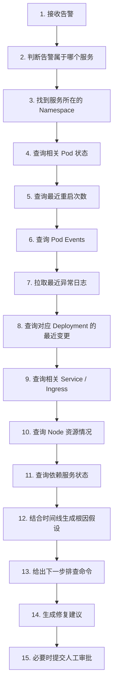

# AI Agent 接管 Kubernetes 排障？从 EKS 知识图谱看下一代运维

> **来源：** 微信公众号  
> **原标题：** AI Agent 接管 Kubernetes 排障？从 EKS 知识图谱看下一代运维  
> **整理时间：** 2026-05-29

---

今天继续来聊下 AI 这个话题，目前我也在还在用 AI 去打磨这一个架构，后续给大家提供一个用 vibe coding 的流程去做这个项目架构。文章有点长，大家慢慢看吧。

---

AI + DevOps，大部分人应该基本都停留在一个层面：

- AI 帮你写 Shell 脚本
- AI 帮你写 Dockerfile
- AI 帮你生成 Kubernetes YAML
- AI 帮你解释一段报错日志

这些当然有用，但说实话，这还不算真正改变运维体系。

真正让我觉得有意思的是，**AI 正在从"回答问题的助手"，变成"参与排障流程的 Agent"**。也就是说，它不只是告诉你命令怎么写，而是开始进入这样的流程：

```
告警触发
↓
识别影响范围
↓
收集日志、指标、事件、变更记录
↓
理解服务之间的依赖关系
↓
推断可能根因
↓
给出修复建议
↓
甚至执行部分操作
```

这才是 AI 对 DevOps 真正有冲击力的地方。

最近 AWS 发布了一篇关于 **AWS DevOps Agent + Amazon EKS 知识图谱** 的文章，里面展示了一个很典型的方向：从告警生成，到识别受影响的 EKS 集群，再到构建知识图谱，最后辅助排查应用和基础设施问题，目标是降低 Kubernetes 运维中的 MTTI 和 MTTR。


这件事值得运维人认真看一眼。因为它代表的不是一个单点工具，而是**下一代运维模式的雏形**。

---

## 一、Kubernetes 排障为什么这么痛苦？

做过 Kubernetes 运维的人都知道，K8s 的问题很少是一个点的问题。一个服务异常，背后可能牵扯很多东西：

| 类别 | 可能的问题点 |
|------|-------------|
| **Pod** | 状态异常、重启、CrashLoopBackOff |
| **Deployment** | 副本数不足、滚动更新失败 |
| **Service** | 转发规则错误、Endpoint 为空 |
| **Ingress** | 路由规则、TLS 证书 |
| **Node** | 资源不足、节点 NotReady |
| **PVC** | 挂载失败、存储不足 |
| **ConfigMap / Secret** | 配置错误、权限不足 |
| **HPA** | 扩缩容异常 |
| **网络** | CNI、CoreDNS、网络策略 |
| **依赖服务** | 数据库、Redis、外部 API |

比如一个接口突然 5xx 增加，你不能只看应用日志。你可能要查：

```bash
kubectl get pod -n xxx
kubectl describe pod xxx -n xxx
kubectl logs xxx -n xxx --previous
kubectl get events -n xxx --sort-by=.lastTimestamp
kubectl get deploy,svc,ingress -n xxx
kubectl top pod -n xxx
kubectl top node
```

然后你还要看 Prometheus 指标、Grafana 图表、ELK 日志、CI/CD 发布记录、变更工单、网络策略、数据库连接池、上游服务状态。

最后才可能判断：

- 是代码问题？
- 是配置变更？
- 是资源不足？
- 是依赖服务异常？
- 是流量突增？
- 是节点故障？
- 是发布引入的问题？
- 还是某个外部服务超时？

这就是 Kubernetes 排障最麻烦的地方：**信息太分散，关系太复杂，上下文太多**。

传统监控系统通常只能告诉你：

```
CPU 高了
内存高了
Pod 重启了
接口错误率高了
延迟变高了
```

但它很难直接告诉你：

- 为什么高？
- 影响了谁？
- 和哪个变更有关？
- 根因更可能在哪一层？
- 下一步该查什么？

所以传统运维很多时候还是靠人肉串联上下文。而 **AI Agent + 知识图谱**，解决的正是这个问题。

---

## 二、什么是 EKS 运维知识图谱？

知识图谱听起来很抽象，但放到 Kubernetes 场景里，其实可以理解为：把集群里的各种对象和它们之间的关系，用图的方式组织起来。

比如：

```
Cluster
├── Namespace
│   ├── Deployment
│   │   ├── ReplicaSet
│   │   │   └── Pod
│   │   │       ├── Container
│   │   │       ├── Logs
│   │   │       ├── Events
│   │   │       └── Metrics
│   │   ├── ConfigMap
│   │   ├── Secret
│   │   └── ServiceAccount
│   ├── Service
│   ├── Ingress
│   ├── HPA
│   └── NetworkPolicy
├── Node
│   ├── CPU
│   ├── Memory
│   ├── Disk
│   └── Kubelet
└── Addons
    ├── CoreDNS
    ├── CNI
    └── Ingress Controller
```

但它不只是对象列表，而是**关系网络**。比如：

```
Ingress A → Service B → Pod C
Pod C → Node D
Pod C → ConfigMap E
Pod C → Secret F
Pod C → RDS G
Pod C → Redis H
Pod C 最近由 Pipeline I 发布
Pod C 的错误日志与时间点 J 匹配
Node D 同时间出现磁盘压力
```

这就是知识图谱的价值。它能把原本分散在不同系统里的信息串起来。

对于人来说，这是**排障经验**。对于 AI Agent 来说，这是**推理上下文**。没有上下文，AI 只能瞎猜。有了上下文，AI 才能更接近一个真正的运维助手。


---

## 三、AI Agent 排障，不是简单问一句"为什么挂了"

很多人对 AI 排障有误解，以为就是把日志丢给大模型，然后问：这个报错是什么原因？

这只能算最初级的用法。

真正的 AI Agent 排障，应该是**多步骤**的。比如一个服务出现 5xx 告警，AI Agent 应该这样工作：



这才像一个真正的 Agent。

AWS 那篇 EKS 文章强调的也是类似方向：AWS DevOps Agent 不只是看一个孤立告警，而是从告警出发，识别受影响的 EKS 集群，构建知识图谱，并辅助排查应用或基础设施问题，最终目标是降低 Kubernetes 运维中的平均识别时间（MTTI）和平均修复时间（MTTR）。

这里最关键的不是"AI 会回答问题"，而是：**AI 开始理解系统之间的关系**。

---

## 四、下一代运维的核心，不是监控，而是上下文

以前我们做运维，经常说监控很重要。但现在我越来越觉得，下一代运维最重要的不只是监控，而是**上下文**。

> **监控**告诉你发生了什么。  
> **上下文**告诉你为什么可能发生。

### 场景一：发布导致的问题

```
10:01 发布了新版本
10:03 某个 Deployment 开始滚动更新
10:04 新 Pod Ready
10:05 错误率开始升高
10:06 日志出现数据库字段缺失错误
10:07 老版本 Pod 无同类错误
```

根因：**大概率是新版本代码或数据库兼容问题**。

### 场景二：节点资源问题

```
10:01 某个 Node 内存压力升高
10:02 多个 Pod 被驱逐
10:03 某服务副本不足
10:04 Service 后端 Endpoint 变少
10:05 接口 5xx 增加
```

根因：**节点资源或调度问题**。

运维真正难的地方，不是看单个指标。而是**把这些信息串成一条时间线**。这也是 AI Agent 最适合切入的地方。

---

## 五、AI Agent 在 Kubernetes 排障里的典型架构

如果我们不依赖 AWS，也要自己做一个类似的 K8s AI 排障系统，大概可以这样设计。

### 1. 数据采集层

先把 Kubernetes 相关数据采集起来：

- Kubernetes API
- Prometheus Metrics
- Loki / ELK Logs
- Kubernetes Events
- CI/CD 发布记录
- Git Commit / PR 信息
- Ingress / Gateway 日志
- 云厂商资源状态
- 数据库 / Redis / MQ 指标
- 告警平台数据

### 2. 关系建模层

把资源关系整理出来：

| 关系 | 描述 |
|------|------|
| Cluster → Namespace | 集群包含命名空间 |
| Namespace → Deployment | 命名空间包含工作负载 |
| Deployment → ReplicaSet | 工作负载管理副本集 |
| ReplicaSet → Pod | 副本集管理 Pod |
| Service → Endpoint → Pod | 服务通过 Endpoint 指向 Pod |
| Ingress → Service | 入口路由到服务 |
| Pod → Node | Pod 调度到节点 |
| Pod → ConfigMap / Secret | Pod 引用配置 |
| Pod → PVC | Pod 挂载存储 |
| Pod → ServiceAccount | Pod 使用服务账户 |

如果能进一步接入业务拓扑，还可以加上：

```
订单服务 → 支付服务
支付服务 → Redis
支付服务 → MySQL
网关服务 → 用户服务
用户服务 → 认证服务
```

### 3. 时间线关联层

排障一定要看时间线：

- 告警时间
- 发布上线时间
- Pod 重启时间
- Node 异常时间
- 日志异常时间
- 流量突增时间
- 配置变更时间
- 扩缩容时间

很多故障，其实靠时间线就能缩小范围。

### 4. AI 推理层

让 AI Agent 基于上下文做判断：

- 当前影响范围是什么？
- 最可能的根因有哪些？
- 哪些证据支持这个判断？
- 哪些证据还不够？
- 下一步应该查什么？
- 是否存在高风险修复动作？
- 是否需要人工审批？

### 5. 执行层

执行层必须谨慎。建议分级处理：

| 级别 | 描述 | 示例 |
|------|------|------|
| L1 | 只读查询 | `kubectl get`, `describe`, `logs`, `top` |
| L2 | 生成建议 | 输出排查方向 |
| L3 | 生成修复命令，但不执行 | `kubectl rollout restart` 建议 |
| L4 | 低风险操作自动执行 | 清理已完成 Job |
| L5 | 高风险操作必须人工审批 | 删资源、改网络策略、改生产镜像 |

这些可以**先只读**：
```bash
kubectl get
kubectl describe
kubectl logs
kubectl top
```

这些**建议人工审批**：
```bash
kubectl rollout restart
kubectl scale
kubectl delete pod
kubectl apply
kubectl patch
```

这些**更要严格控制**：
- 删除资源
- 修改网络策略
- 修改 Ingress
- 修改存储
- 修改数据库连接配置
- 修改生产环境镜像版本

---

## 六、AI Agent 排障的关键，不是"敢不敢自动修"，而是"能不能可信"

很多人一听 AI 运维，就会问：AI 会不会乱执行命令？

这个担心是对的。生产环境不是玩具，AI 一旦误操作，可能比人手滑还严重。

所以我认为，AI Agent 在运维场景里，短期内不应该追求完全自动修复。更现实的落地路径应该是：

| 阶段 | 能力 |
|------|------|
| 第一阶段 | AI 解释告警 |
| 第二阶段 | AI 汇总上下文 |
| 第三阶段 | AI 生成排查路径 |
| 第四阶段 | AI 给出根因假设 |
| 第五阶段 | AI 生成修复方案 |
| 第六阶段 | 人审核后执行 |
| 第七阶段 | 低风险动作自动执行 |

也就是说，先让 AI 变成一个**"高级排障助手"**。不要一上来就让它变成"生产环境管理员"。

对于大多数企业来说，AI 最先能产生价值的地方，是**降低 MTTI**（Mean Time To Identify）。也就是减少"我到底该从哪里开始查"的时间。

很多故障处理时间，不是花在修复上，而是花在定位上。一个生产故障，可能真正修复只需要一条命令。但找出该执行哪条命令，可能要花半小时甚至几个小时。AI Agent 如果能把这个时间缩短，就是很大的价值。

---

## 七、DevOps 人员会被 AI Agent 替代吗？

这个问题很现实。

我的判断是：**只会复制命令、只会机械执行流程的运维，会被压缩价值。但真正懂系统、懂架构、懂风险、懂自动化闭环的 DevOps，不会那么容易被替代。**

因为 AI Agent 需要人来设计。它需要有人告诉它：

- 哪些数据要采集
- 哪些关系要建模
- 哪些命令能执行
- 哪些命令不能执行
- 哪些场景要审批
- 哪些场景能自动处理
- 哪些告警是噪音
- 哪些故障是高优先级
- 哪些修复动作有副作用

AI 能帮你排障，但前提是**你得把运维经验结构化**。

### 运维能力的演变

| 过去 | 未来 |
|------|------|
| 我知道怎么查 | 我能把排障流程写成 Runbook |
| 我知道怎么修 | 我能把 Runbook 接入 AI Agent |
| 我知道哪里容易出问题 | 我能让 AI 安全地调用工具 |
| — | 我能设计权限边界 |
| — | 我能验证 AI 的判断 |
| — | 我能把故障经验沉淀进知识库 |
| — | 我能让系统越用越聪明 |

**这才是下一代运维的门槛。**

---

## 八、Kubernetes 排障会变成"人 + Agent"的协作

未来的 Kubernetes 排障流程，可能会变成这样：

```
Prometheus 触发告警
↓
Alertmanager 推送事件
↓
AI Agent 接收告警
↓
自动查询 Kubernetes API
↓
拉取 Pod / Node / Event / Log / Metric
↓
关联最近发布和配置变更
↓
构建服务拓扑和时间线
↓
生成根因假设
↓
输出修复建议
↓
运维人员确认
↓
执行修复动作
↓
自动生成故障复盘
```

这和传统排障最大的区别是：

- **以前**是人到处找信息。
- **以后**是 Agent 先把信息整理好，再交给人判断。

- **以前**运维人员的时间花在：查命令 → 翻日志 → 找图表 → 问开发 → 看发布记录 → 拼时间线
- **以后**运维人员的时间应该更多花在：判断风险 → 确认根因 → 审核方案 → 优化系统 → 沉淀经验 → 设计自动化流程

**这就是 DevOps 岗位的变化。**

---

## 九、企业要落地 AI + Kubernetes 排障，先做什么？

如果一家企业现在就想尝试 AI + K8s 排障，我建议不要一开始就搞得太大。可以从三个小场景开始。

### 场景一：告警解释助手

当 Prometheus 触发告警后，自动生成说明：

```
告警名称：xxx
影响服务：xxx
影响 Namespace：xxx
相关 Pod：xxx
最近异常日志：xxx
最近 Events：xxx
可能原因：xxx
建议排查命令：xxx
```

这一步就已经能节省很多时间。

### 场景二：Pod 异常自动诊断

比如 Pod 出现这些状态：

- CrashLoopBackOff
- ImagePullBackOff
- OOMKilled
- Pending
- Evicted
- CreateContainerConfigError

AI Agent 自动执行只读查询，然后生成诊断报告。例如：

```bash
kubectl describe pod
kubectl logs --previous
kubectl get events
kubectl describe node
kubectl get pvc
```

然后输出：

```
当前状态：CrashLoopBackOff
关键异常：exit code 137 (OOM)
可能原因：内存限制过小
建议修复方式：调整 resources.limits.memory
风险提示：需要确认是否有内存泄漏
```

### 场景三：发布后异常关联

每次 CI/CD 发布后，自动观察：

- 错误率是否升高
- 延迟是否升高
- Pod 是否重启
- 日志是否出现新异常
- 核心接口是否异常

如果发布后 5-10 分钟内异常升高，AI Agent 自动生成分析：

```
异常是否与本次发布相关：是/否
影响哪些接口：/api/xxx
是否建议回滚：是
回滚命令：kubectl rollout undo deployment/xxx -n xxx
是否需要人工确认：是
```

这个场景非常实用。

---

## 十、别高估短期，也别低估长期

现在的 AI Agent 还不能完全替代一个成熟运维。

- 它会误判
- 它会遗漏上下文
- 它可能生成危险命令
- 它也可能把无关日志强行关联

所以短期内，AI Agent 不能直接接管生产环境。

但长期看，它一定会深度进入 DevOps 体系。因为 **Kubernetes 排障本质上就是**：

- 大量上下文
- 复杂关系
- 重复查询
- 经验判断
- 流程沉淀

而这些正是 AI Agent 擅长逐步增强的领域。

未来企业的运维平台，很可能不再只是监控大盘、日志系统、发布系统、CMDB 各自独立。而是会变成一个**围绕 AI Agent 组织起来的运维中枢**：

| 组件 | 角色 |
|------|------|
| 监控 | 发现问题 |
| 日志 | 提供证据 |
| CMDB | 提供资产关系 |
| Kubernetes API | 提供实时状态 |
| CI/CD | 提供变更记录 |
| 知识库 | 提供经验 |
| **AI Agent** | **串联上下文** |
| **人** | **最终判断和治理** |

---

## 结尾：AI 不一定接管运维，但一定会重写运维

AI Agent 接管 Kubernetes 排障，这句话听起来有点夸张。但方向并不夸张。

因为运维行业一直在做一件事：**把人的经验沉淀成系统能力**。

- 最早靠人手工操作
- 后来靠 Shell 脚本
- 再后来靠 Ansible、Terraform、CI/CD、Prometheus、ELK、Kubernetes
- **现在轮到 AI Agent 了**

它不是突然冒出来替代所有运维，而是接在过去自动化体系之后，继续把更多复杂判断和上下文分析能力平台化。

所以，对 DevOps 来说，真正的问题不是：**AI 会不会替代我？**

而是：**我能不能把自己的运维经验，变成 AI Agent 可以调用、可以验证、可以执行的系统能力？**

未来值钱的运维，不是最会敲命令的人。而是**能设计下一代运维系统的人**。

**Kubernetes 排障只是开始。真正的变化，是整个 DevOps 工作方式正在被 AI Agent 重写。**

---

**END**
